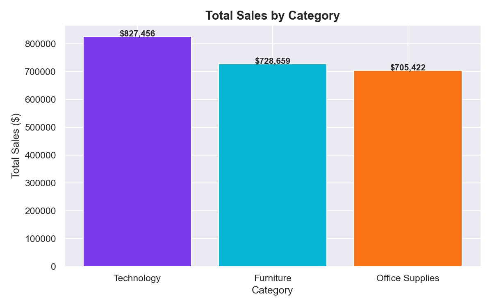
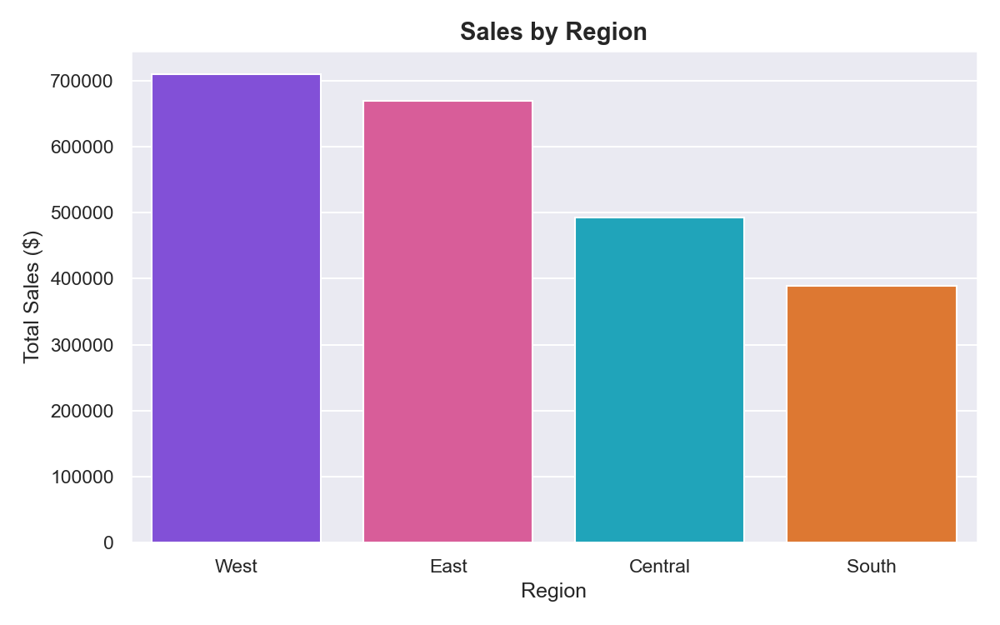
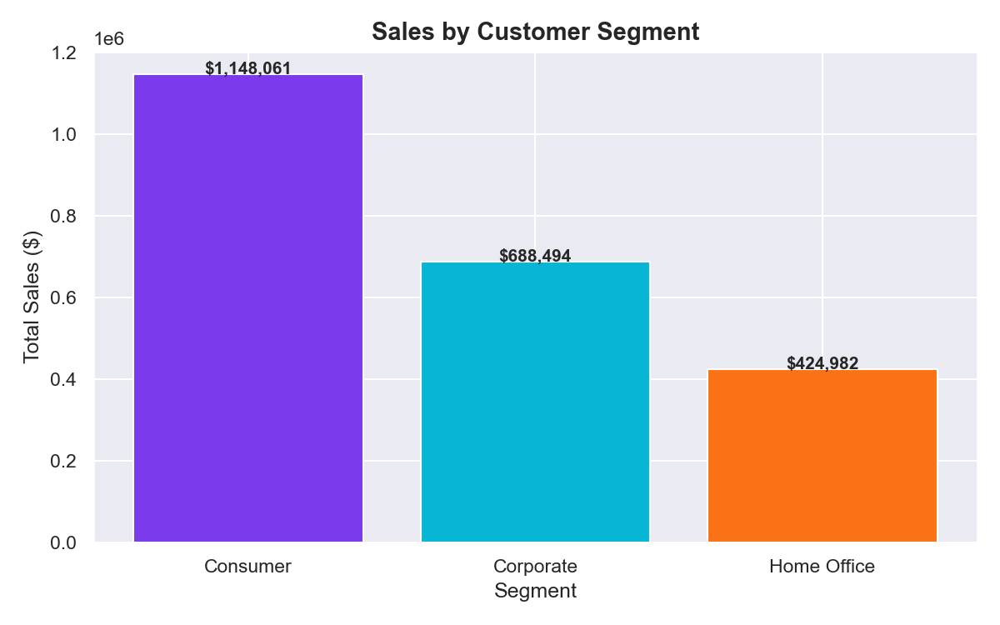
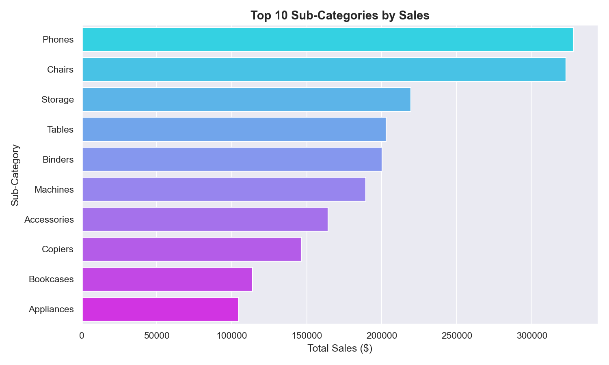
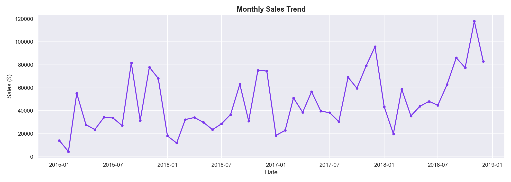
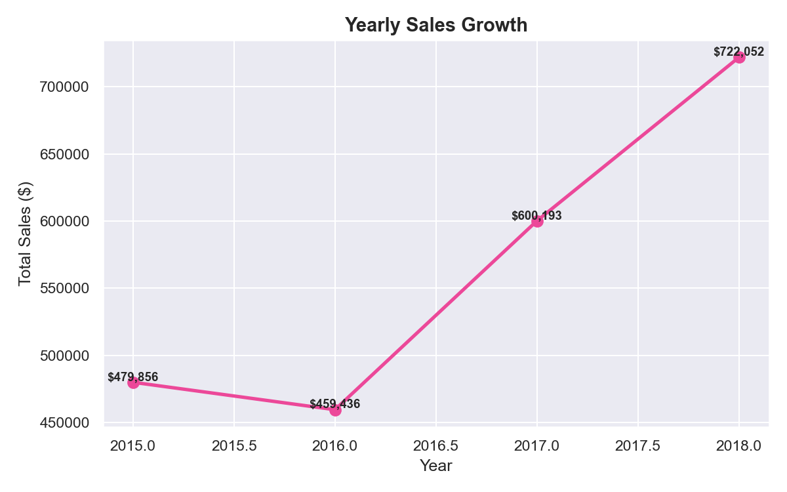
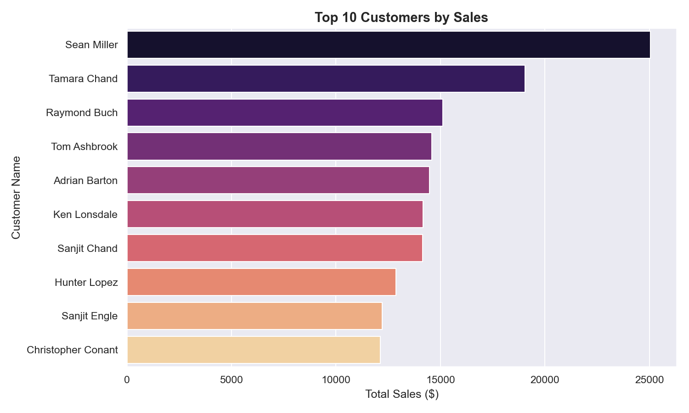
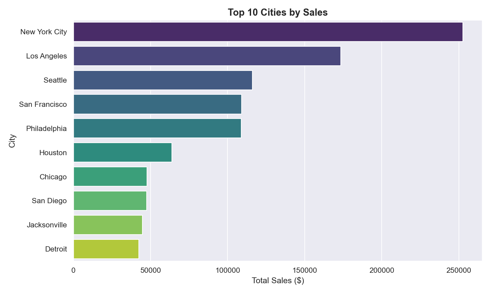

# 📦 Superstore Sales Analysis

### Business Intelligence & EDA using Python

---

## 📌 Project Overview

Analyzed **4 years of US retail sales data** to uncover
what drives revenue, which products perform best,
which regions lead, and where the business should focus
to maximize growth.

> 💼 This kind of analysis helps **retail businesses, e-commerce stores,
> and sales teams** make smarter decisions about products, pricing,
> and regional strategy.

---

## 🎯 Business Questions Answered

| # | Question |
|---|----------|
| 1 | Which category generates the most revenue? |
| 2 | Which region performs best in sales? |
| 3 | Which customer segment drives the most orders? |
| 4 | Who are the top 10 customers by revenue? |
| 5 | Which sub-categories lead in sales? |
| 6 | How has the business grown year over year? |
| 7 | Which cities generate the highest sales? |
| 8 | What is the monthly sales trend? |

---

## 📊 Key Insights

- 🏆 **Technology leads all categories** in total revenue
- 🌍 **West region is the strongest market** across all years
- 👤 **Consumer segment drives the most sales** — biggest buyer group
- 📈 **Sales grew consistently** from 2015 to 2018
- 🏙️ **New York City is the #1 city** by sales volume
- 📅 **November is peak month** — holiday season effect
- 🥇 **Phones & Chairs** are the top sub-categories by revenue
- 👥 **Top 10 customers contribute significantly** to total revenue

---

## 📸 Visualizations

### 🏷️ Sales by Category

### 🌍 Sales by Region

### 👤 Sales by Segment

### 🏅 Top 10 Sub-Categories

### 📈 Monthly Sales Trend

### 📅 Yearly Sales Growth

### 👥 Top 10 Customers

### 🏙️ Top 10 Cities

---

## 🛠️ Tools & Technologies

| Tool | Purpose |
|------|---------|
| Python 3.10 | Core programming |
| Pandas | Data cleaning & analysis |
| Matplotlib | Chart creation |
| Seaborn | Styled visualizations |
| VS Code | Development environment |
| Jupyter Notebook | Interactive analysis |

---

## 📂 Dataset

- **Source:** [Kaggle — Superstore Sales Dataset](https://www.https://www.kaggle.com/datasets/rohitsahoo/sales-forecasting)
- **Size:** 9800 rows × 18 columns
- **Period:** 2015 – 2018
- **Region:** United States

---

## 📁 Project Structure